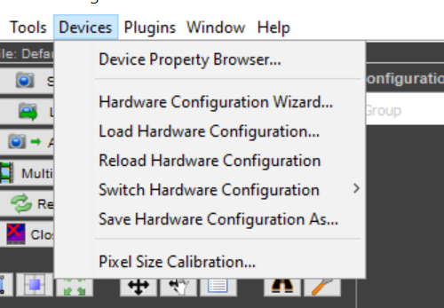

# CSL-camera

This repository explains how to control a camera with Python provided a .dll library exists to control it with Micro-Manager. 
It uses the library [pymmcore-plus](https://github.com/pymmcore-plus/pymmcore-plus).


**Prerequisites**:

- The drivers of the cameras have been installed
- The camera is in the database of Micro-Manager (.dll provided by the manufacturer)
- This code was tested on Windows 


## Codes and files provided :chart_with_upwards_trend:
[CSLcamera](CSLcamera/CSLcamera.py) can be used in the following way:

```
from ControlCamera import ControlCamera
import cv2
import os


# Define test configuration file and parameters

CAM_PARAMS = {"TriggerMode": "On", #off
             "TriggerSource": "Line0"} #Software
CONFIG_FILE = "MMconfig/Daheng.json"

# Initialize the camera controller
camera = ControlCamera(CONFIG_FILE, CAM_PARAMS)

# Test parameter update and retrieval
camera.update_param("TriggerMode", "Off")
print("Updated Exposure:", camera.get_param("TriggerMode"))

# Test snapping an image
camera.snap_image()
cv2.imshow("Snapped Image", cv2.normalize(camera.image, None, 255, 0, cv2.NORM_MINMAX, cv2.CV_8UC1))
cv2.waitKey(0)
cv2.destroyAllWindows()

# Test continuous streaming (press 'q' to quit)
print("Starting Continuous Streaming...Press q to exit")
camera.continuous_stream()

# Test video capture
print("Capturing Video...")
camera.snap_video(10)

# Save video
SAVE_PATH = "test_output"
os.makedirs(SAVE_PATH, exist_ok=True)
camera.save_video(SAVE_PATH)
```

## Install the library

```
git clone XXXXXXXX
cd CSL-camera
python setup.py develop
```


## Control camera

* If not done already: install micromanager  
  * [Windows](https://micro-manager.org/Download_Micro-Manager_Latest_Release)
  * [Linux](https://micro-manager.org/Linux_installation_from_source_MM2)
  
Plug the camera to the computer. 

Set the Hardware Config File to "(none)" and press "OK"

<p align="center">
<a> </a>
</p>

Open **Tools > Options**
Make sure "Run server on port 4827" is clicked.

<p align="center">
<a> </a>
</p>


Open **Devices > Hardware configuration wizard** and create a new configuration. 

<p align="center">
<a> </a>
</p>

In **Available devices**, click **List by type** and select your camera by **double-clicking**.  Create a folder "Config" in the Micromanager folder and save your config file inside calling it "Daheng.cfg". 

In **Devices>Device Property Browser** you will find the same of the properties that you can edit later in the python code that controls the camera. 


```cam.mmc.getProperty(cam.name, 'Frame Rate')```
```cam.mmc.setProperty(cam.name, 'prop', val)```


<p align="center">
<a> </a>
</p>


Create a .json file following the model **MMconfig/Daheng.json** to set the base parameters of the camera. Specify the path to Micro-Manager .cfg file created previously.

Now **make sure to close Micro-Manager and have the camera connected to your computer** to test the camera.  

Open the code **Camera.py** and modify manually the paths: 
- mm_dir is where Micro-Manager program is stored
- the parameter config_file is where the .json file is stored
- the parameter cam_param is your local update of the parameters (framerate, gain, etc...) and should be specified as a dictionary with entries similar to the .json file.  


You will be able to use the python code to do live stream, snapshot or video acquisition, comment the parts you are not interested in in the __main__ of **Camera.py**

Launch the code by typing in the command line: 

```python Camera.py```


* You might encounter trouble if pymmcore version doesn't match Micro-Manager version. To check Micro-Manager version: **Help>About Micro-Manager**
  
<p align="center">
<a> </a>
</p>

Then check the [pymmcore Releases](https://github.com/micro-manager/pymmcore/releases) page to find the version number that matches Micro-Manager's. Copy the commit number 

<p align="center">
<a> </a>
</p>


In the command line type: 

```pip uninstall pymmcore ```
```pip install pymmcore==X.X.X.X``` 

Here it would be pymmcore==10.3.0.71.0

Now test again: 

```python Camera.py```

### Documentation
You can import the class Camera.py for modular usage of the library.

**ControlCamera** class: This class represents a control interface for a camera. It inherits from the threading.Thread class and provides methods for controlling the camera, capturing images, and recording videos.

Methods of ControlCamera class:

  - **__init__**: Initializes the ControlCamera object by loading the configuration from a JSON file, setting camera parameters, and initializing the Micro-Manager Core.
  - **clip_im**: Clips the input image based on the specified minimum and maximum quantiles.
  - **update_param**: Updates a camera parameter with the specified key to the given value.
  - **get_param**: Retrieves the current value of a camera parameter with the specified key.
  - **continuous_stream**: Performs continuous streaming of camera frames and displays them in a window.
  - **reset**: Resets the camera.
  - **snap_image**: Captures a single image from the camera.
  - **snap_video**: Captures a video with the specified number of frames.
  - **run**: Runs the camera based on the specified camera mode.
  - **save_video**: Saves the captured video frames to a folder and logs the timing information.


### License

This project is licensed under the [GNU General Public License v3.0](https://www.tldrlegal.com/license/gnu-general-public-license-v3-gpl-3)
